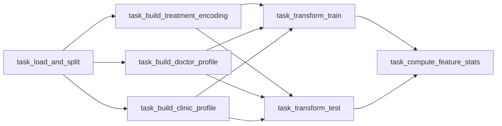

# DentTime

Dental appointment no-show prediction — SE for ML term project.

The pipeline takes raw appointment data, engineers features (doctor profiles, clinic profiles, treatment encoding), and outputs train/test parquet files ready for model training. Two execution modes are supported: a standalone script for quick local runs, and an Apache Airflow DAG inside Docker Compose for reproducible, observable, step-by-step reruns.

---

## Project Structure

```
DentTime/
├── data/
│   └── raw/                      # Anonymized input data (git-ignored, not committed)
│       └── data.csv              # ← place file here before running
├── feature_engineering.py        # Standalone script (no Docker needed)
├── src/features/                 # Feature engineering modules
│   ├── build_profiles.py         # Doctor & clinic profile builders
│   ├── feature_transformer.py    # FeatureTransformer + encoding
│   ├── treatment_mapper.py
│   └── tooth_parser.py
├── airflow/dags/
│   └── feature_engineering_dag.py  # 7-task Airflow DAG
├── docker/
│   ├── Dockerfile.airflow
│   └── docker-compose.yml
├── features/                     # Pipeline outputs (DVC-tracked)
│   ├── features_train.parquet
│   ├── features_test.parquet
│   └── feature_stats.json
├── src/features/artifacts/       # Fitted artifacts (DVC-tracked)
│   ├── doctor_profile.json
│   ├── clinic_profile.json
│   └── treatment_encoding.json
├── tests/                        # Unit + DAG structure tests
├── Makefile                      # dvc-commit target
└── docs/
    ├── runbook-airflow-pipeline.md  # Operations guide
    └── ADR-001-airflow-feature-pipeline.md
```

---

## Data

Raw data is produced by a separate, access-controlled pipeline maintained by [@natchyunicorn](https://github.com/natchyunicorn). For full details on the data collection pipeline, please refer to the upstream repository: [https://github.com/natchyunicorn/denttime.git](https://github.com/natchyunicorn/denttime.git). 

Place the anonymized output at `data/raw/data.csv` before running the pipeline. Contact the data owner for access.

This repo contains no patient data and no PII — only the anonymized CSV (excluded from git via `.gitignore`) and the ML pipeline that consumes it.

---

## Feature Engineering Quick Start — Standalone Script

No Docker required. Runs the full feature engineering pipeline in one shot.

```bash
pip install -r requirements-fe.txt
python feature_engineering.py --input "data/raw/data.csv" --output features/
```

---

## Feature Engineering Pipeline — Airflow + Docker

Runs the same logic as 7 independent tasks. Each task can be rerun individually without re-running the whole feature engineering pipeline (e.g., rebuild only the doctor profile after new data arrives).

**Prerequisites:** Docker Desktop with ≥ 6 GB RAM allocated.

```bash
# 1. Start
cd docker/
docker compose up --build -d   # first run ~3–5 min

# 2. Open UI: http://localhost:8080  (admin / admin)
#    DAGs → denttime_feature_engineering → ▶ Trigger DAG

# 3. After all 7 tasks turn green — version the outputs
cd ..
make dvc-commit
git commit -m "feat: update features $(date +%Y-%m-%d)"

# 4. Stop
cd docker/ && docker compose down
```

See [docs/runbook-airflow-pipeline.md](docs/runbook-airflow-pipeline.md) for selective reruns, troubleshooting, and the full operations guide.

---

## Task Graph



All inter-task communication is via files on shared volumes — no Airflow XCom.

---

## Tests

```bash
pip install -r requirements-fe.txt
pytest tests/ -v
```

DAG structure tests (`tests/dags/`) use Python's `ast` module and require no Airflow installation.

---

## Data Versioning

Outputs are tracked with DVC. To restore the last committed feature set:

```bash
dvc checkout
```

To version new outputs after a pipeline run:

```bash
make dvc-commit
git commit -m "feat: update features $(date +%Y-%m-%d)"
```
