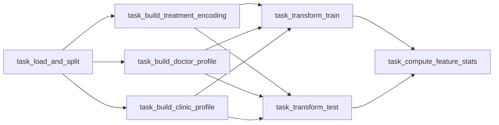

## Project Overview

DentTime predicts dental appointment duration (classification into {15, 30, 45, 60, 75, 90, 105} minutes) using an XGBoost model trained on 17 engineered features.

---

## Project Structure

```
DentTime/
├── data/
│   └── raw/                          # Anonymized input data (git-ignored)
│       └── data.csv                  # ← place file here before running
├── feature_engineering.py            # Standalone feature engineering script
├── src/features/                     # Feature engineering modules
│   ├── feature_transformer.py        # FeatureTransformer + FEATURE_COLUMNS
│   ├── build_profiles.py             # Doctor & clinic profile builders
│   ├── treatment_mapper.py
│   ├── tooth_parser.py
│   └── artifacts/                    # Fitted artifacts (DVC-tracked)
│       ├── doctor_profile.json
│       ├── clinic_profile.json
│       └── treatment_encoding.json
├── features/                         # Pipeline outputs (DVC-tracked)
│   ├── features_train.parquet
│   ├── features_test.parquet
│   └── feature_stats.json
├── airflow/dags/
│   ├── feature_engineering_dag.py    # 7-task feature engineering DAG
│   └── denttime_retrain_dag.py       # 5-task retrain DAG (with MLflow)
├── Trianing/
│   └── train.py                      # Standalone training script
├── backend/app/                      # FastAPI inference service
│   ├── main.py
│   ├── routers/
│   └── services/
├── frontend/                         # React 19 + Vite + Chakra UI + Tailwind
├── monitoring/                       # Metrics state (state.json)
├── prometheus/                       # Alert rules
├── grafana/                          # Dashboard provisioning
├── artifacts/
│   └── model.joblib                  # Serialized model bundle
├── docker-compose.yml                # Unified compose (profiles: training, serving)
├── Makefile
└── docs/
    ├── runbook-airflow-pipeline.md
    └── ADR-001-airflow-feature-pipeline.md
```

---

## Data

Raw data is produced by a separate, access-controlled pipeline maintained by [@natchyunicorn](https://github.com/natchyunicorn). Place the anonymized output at `data/raw/data.csv` before running the pipeline. Contact the data owner for access.

This repo contains no patient data and no PII.

---

## Quick Start

All services are defined in the root `docker-compose.yml` and activated via profiles.

| Profile | Make target | Services | Ports |
|---|---|---|---|
| `training` | `make up-train` | Airflow, MLflow, Postgres | :8080, :5008 |
| `serving` | `make up-serve` | Backend, Frontend, Prometheus, Grafana | :8001, :5173, :9090, :3000 |
| _(both)_ | `make up` | All of the above | all ports |

```bash
# Feature engineering + model retraining stack
make up-train

# Web app + monitoring stack
make up-serve

# Full stack (demo mode)
make up

# Stop everything
make down

# Validate compose syntax
make validate
```

---

## Feature Engineering Pipeline — Airflow

Runs as 7 independent tasks. Each task can be rerun without rerunning the whole pipeline.

**Prerequisites:** Docker Desktop with ≥ 6 GB RAM allocated.

```bash
# 1. Start training stack
make up-train

# 2. Open Airflow UI: http://localhost:8080  (admin / admin)
#    DAGs → denttime_feature_engineering → ▶ Trigger DAG

# 3. After all 7 tasks turn green — version the outputs
make dvc-commit
git commit -m "feat: update features $(date +%Y-%m-%d)"

# 4. Stop
make down
```

### Task Graph



All inter-task communication is via files on shared volumes — no Airflow XCom.

---

## Standalone Feature Engineering (no Docker)

```bash
pip install -r requirements-fe.txt
python feature_engineering.py --input "data/raw/data.csv" --output features/
```

---

## Model Retraining

The `denttime_retrain_dag` (5 tasks) runs inside the training stack and tracks experiments with MLflow.

```
features/features_{train,test}.parquet
  └─► load_features → train_model → rank_features → evaluate_model → export_artifacts
        └── writes models/model.joblib
```

MLflow UI: http://localhost:5008

For standalone training without Docker:

```bash
cd Trianing/
pip install -r requirements.txt
python train.py
```

---

## Frontend + Backend + Monitoring

```bash
make up-serve
```

| Service | URL |
|---|---|
| Backend API docs | http://localhost:8001/docs |
| Frontend | http://localhost:5173 |
| Prometheus | http://localhost:9090 |
| Grafana | http://localhost:3000 |

The `metrics_updater` service runs every 15 s, computing PSI, F1, and MAE from SQLite and writing `monitoring/state.json` for Prometheus.

---

## Tests

```bash
pip install -r requirements-fe.txt
pytest tests/ -v                                   # all tests
pytest tests/test_feature_transformer.py -v        # single file
pytest tests/dags/ -v                              # DAG structure tests (no Airflow needed)
```

---

## Data Versioning (DVC)

Outputs are tracked with DVC. To restore the last committed feature set:

```bash
dvc checkout
```

To version new outputs after a pipeline run:

```bash
make dvc-commit
git commit -m "feat: update features $(date +%Y-%m-%d)"
```

---

## Frontend Development

```bash
cd frontend/
npm run dev     # dev server :5173
npm run lint    # eslint
npm run build   # tsc + vite build
```

---

## Monitoring Demo Scripts

Two scripts simulate monitoring degradation for classroom / grader demos. Both require the serving stack to be running (`make up-serve`, backend at `http://localhost:8000`).

| Script | What it does | Alerts triggered |
|---|---|---|
| `run_data_diff_demo` | 80 requests with unseen treatments + extreme values | `FeatureDriftHigh`, `MissingRateHigh` |
| `run_critical_alert_demo` | 170 requests with wrong actual labels in two batches | `MacroF1Drop`, `UnderEstimationHigh` |

**macOS / Linux** (requires `curl` and `python3`, both built-in on macOS):

```bash
# Data drift demo — PSI > 0.25 on several features
bash scripts/run_data_diff_demo.sh

# Critical alert demo — Macro F1 drop + under-estimation
bash scripts/run_critical_alert_demo.sh
```

**Windows (PowerShell)**:

```powershell
# Data drift demo
scripts\run_data_diff_demo.bat

# Critical alert demo
scripts\run_critical_alert_demo.bat
```

After the script finishes, open:

| Page | URL |
|---|---|
| Grafana dashboard | http://localhost:3000/d/denttime-prometheus/denttime-monitoring-dashboard |
| Prometheus alerts | http://localhost:9090/alerts |
| Raw metrics | http://localhost:8000/metrics |

> **Note:** If Prometheus shows `Pending` instead of `Firing`, wait ~1 minute — alert rules use `for: 1m`.
